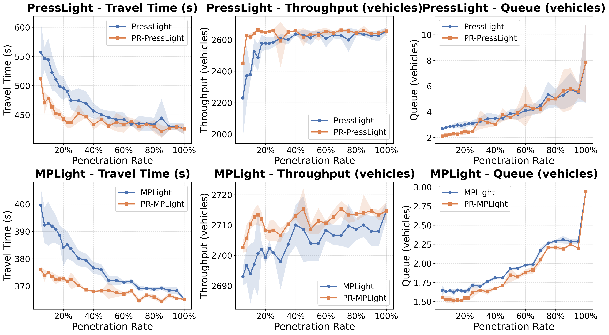
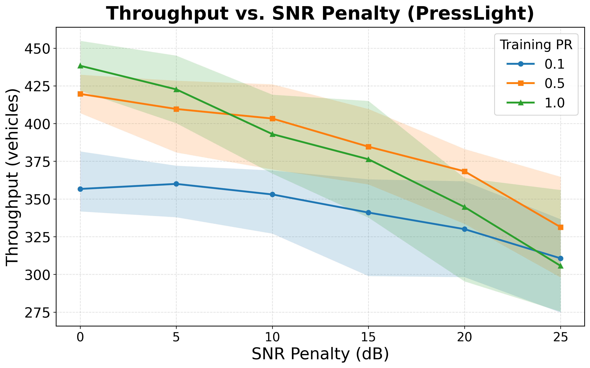
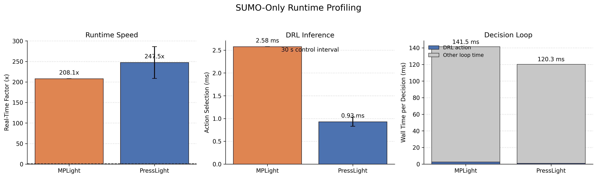

# PAPL-TSC: Penetration-Aware Policy Learning for Traffic Signal Control

Deep reinforcement learning (DRL) traffic signal control under **partial vehicle
observability**, evaluated in a realistic **C-V2X communication environment**
through **SUMO ↔ OMNeT++/Simu5G** co-simulation.

This repository accompanies our paper on penetration-aware traffic signal
control. It provides the training, inference, co-simulation, and analysis code
used to study how DRL controllers (**PressLight** and **MPLight**) degrade as the
fraction of connected vehicles (the *penetration rate*) decreases, and how
realistic V2I packet loss and delay affect control quality.

---

## Highlights

- **Penetration-aware evaluation.** Train at full observability and test across
  a sweep of penetration rates (0.05 → 1.0), or train and test at matched rates
  to build a penetration-indexed policy bank (PR-PressLight / PR-MPLight).
- **C-V2X co-simulation.** A live SUMO ↔ OMNeT++/Simu5G loop replaces idealized
  observations with the set of vehicles that *actually* delivered a V2I message,
  under different SNR-penalty conditions.
- **Communication analysis.** Message-loss ratio (MLR) and end-to-end packet
  delay are extracted directly from OMNeT++ packet logs.
- **Runtime profiling.** Controller inference latency and real-time factor are
  measured to assess real-time deployment feasibility.
- **Reproducible figures.** Aggregated result CSVs and the trained model banks
  for the Hangzhou 4×4 network are included.

---

## Repository structure

```
PAPL-TSC/
├── run.py                       # Single-experiment entry point (task/agent/world)
├── plot_penetration_results.py  # Penetration + OMNeT result figures
├── requirements.txt
│
├── agent/                       # DRL + classical agents (presslight, mplight, ...)
├── world/                       # Simulator wrappers (world_sumo.py = SUMO + OMNeT hooks)
├── trainer/                     # Training/testing loop (+ runtime profiling)
├── task/ · dataset/ · generator/ · common/ · utils/
├── configs/
│   ├── tsc/                     # Per-agent hyperparameters (base.yml, presslight.yml, ...)
│   └── sim/                     # Network/simulator configs (sumohz4x4.cfg, ...)
│
├── experiments/
│   ├── run_penetration_sweep.py     # Train across penetration rates
│   ├── run_inference_sweep.py       # Evaluate (baseline / matched / live-OMNeT)
│   ├── open_live_omnet_terminals.py # Launch the live OMNeT co-simulation slots
│   ├── omnet_parallel.py            # Port/parallelism helpers for OMNeT
│   ├── configure_omnet_ports.py
│   ├── launch_live_omnet_parallel.sh
│   ├── omnet_port_manifest.json
│   ├── combine_omnet_repeats.py     # Merge repeated OMNeT runs into one CSV
│   ├── compute_omnet_mlr_delay.py   # MLR + E2E delay from OMNeT packet logs
│   ├── summarize_runtime_profiles.py# Aggregate *_RUNTIME.csv files
│   ├── plot_runtime_profiles.py     # Runtime / deployment-feasibility figures
│   └── results/                     # Aggregated result CSVs (mean / std / 95% CI)
│
├── data/
│   ├── raw_data/hangzhou_4x4_gudang_18041610_1h/   # 16-intersection network + demand
│   └── output_data/tsc/
│       ├── sumo_presslight/sumohz4x4/omnet_off__pr_*/   # Trained PressLight bank
│       └── sumo_mplight/sumohz4x4/omnet_off__pr_*/      # Trained MPLight bank
│
└── plots_penetration/           # Generated figures (penetration, OMNeT, runtime)
```

> **Note on co-simulation.** The *live* OMNeT++/Simu5G side of the loop requires a
> separate OMNeT++ workspace and a built Simu5G project; that workspace is **not**
> bundled here. All SUMO-only training, inference, and analysis steps run without it.

---

## Installation

### 1. SUMO (required)

Install [SUMO](https://sumo.dlr.de/docs/Installing/index.html) (≥ 1.12) and make
sure the Python bindings (`libsumo`, `traci`, `sumolib`) are importable.

```bash
# Ubuntu example
sudo add-apt-repository ppa:sumo/stable
sudo apt-get update && sudo apt-get install sumo sumo-tools
export SUMO_HOME=/usr/share/sumo
```

### 2. Python environment

```bash
python3 -m venv .venv
source .venv/bin/activate
pip install -r requirements.txt
```

> A CUDA-enabled PyTorch build is optional; all experiments here run on CPU
> (`--ngpu -1`).

---

## Quick start

All commands are run from the repository root.

### Train a penetration-rate sweep

```bash
python3 experiments/run_penetration_sweep.py \
  --agent presslight --network hangzhou \
  --rates 0.05 0.1 0.25 0.5 1.0 \
  --omnet_modes off --workers 2 --skip_existing
```

### Evaluate (baseline: train @ 1.0, test at every rate)

```bash
python3 experiments/run_inference_sweep.py \
  --agent presslight --network hangzhou --train_pr 1.0 \
  --rates 0.05 0.1 0.25 0.5 1.0 \
  --checkpoint_selection topk --repeats 3 --selection_metric throughput
```

### Evaluate (penetration-matched policy bank, PR-PressLight / PR-MPLight)

```bash
python3 experiments/run_inference_sweep.py \
  --agent mplight --network hangzhou --matched_train_pr \
  --rates 0.05 0.1 0.25 0.5 1.0 \
  --checkpoint_selection topk --repeats 3
```

### Plot penetration + OMNeT results

```bash
python3 plot_penetration_results.py
# figures are written to plots_penetration/
```

---

## Live C-V2X co-simulation (SUMO ↔ OMNeT++/Simu5G)

With an OMNeT++/Simu5G workspace available, the live loop replaces idealized
observations with V2I-delivered vehicles. The 18 communication slots (3
penetration rates × 6 SNR-penalty levels) can be launched together:

```bash
python3 experiments/open_live_omnet_terminals.py
```

A single slot can also be run directly:

```bash
python3 experiments/run_inference_sweep.py \
  --agent presslight --network hangzhou --train_pr 1.0 \
  --rates 1.0 --checkpoint_selection topk --repeats 3 \
  --live_omnet --omnet_slot 3
```

---

## Communication analysis (MLR + delay)

Compute message-loss ratio and end-to-end delay from OMNeT++ packet logs and
aggregate repeated runs:

```bash
python3 experiments/compute_omnet_mlr_delay.py \
  --result_glob '/path/to/OMNeT_results/*Run*/'

python3 experiments/combine_omnet_repeats.py \
  --input_dirs experiments/omnet_1_press experiments/omnet_2_press experiments/omnet_3_press \
  --output experiments/results/omnet_combined_presslight_sumohz4x4_3runs_aggregated.csv
```

SNR-penalty mapping used throughout (slot group → penalty): `0, 5, 10, 15, 20, 25 dB`.

---

## Runtime / deployment-feasibility profiling

The trainer records wall-clock runtime, real-time factor, and per-decision DRL
inference latency for each test run (written as `*_RUNTIME.csv`).

```bash
python3 experiments/summarize_runtime_profiles.py   # -> experiments/results/runtime_profile_summary.csv
python3 experiments/plot_runtime_profiles.py        # -> plots_penetration/runtime_analysis/
```

**SUMO-only profiling (Hangzhou 4×4, 900 s horizon, 30 s control interval):**

| Agent       | Real-time factor | DRL action-selection latency |
|-------------|-----------------:|-----------------------------:|
| PressLight  |          247.5×  |                     0.93 ms  |
| MPLight     |          208.1×  |                     2.58 ms  |

Inference latency (≈1–3 ms) is negligible relative to the 30 s control interval,
indicating the DRL controller is not a bottleneck for real-time operation.

---

## Experimental setup (summary)

| Setting                | Value                                   |
|------------------------|-----------------------------------------|
| Network                | Hangzhou 4×4 (16 controlled intersections) |
| Traffic demand         | 1-hour Hangzhou dataset                 |
| Simulation horizon     | 900 s per evaluation run                |
| SUMO step              | 1 s                                     |
| Control interval       | 30 s (→ 30 decisions per run)           |
| Training episodes      | 50                                      |
| Runs per scenario      | 5 (independent random seeds)            |
| Reporting              | mean ± 95% confidence interval          |
| SNR-penalty levels     | 0, 5, 10, 15, 20, 25 dB                 |

---

## Selected results

The repository includes the aggregated CSV files and generated figures used in
the paper. A few representative outputs are shown below.

<table>
  <tr>
    <td align="center">
      <br/>
      <b>Penetration-aware policy comparison</b>
    </td>
    <td align="center">
      <br/>
      <b>OMNeT++/Simu5G C-V2X impact</b>
    </td>
  </tr>
  <tr>
    <td align="center">
      <br/>
      <b>Throughput and travel-time tradeoff</b>
    </td>
    <td align="center">
      <br/>
      <b>Runtime feasibility analysis</b>
    </td>
  </tr>
</table>

---

## Acknowledgements

This codebase builds on [**LibSignal**](https://github.com/DaRL-LibSignal/LibSignal),
an open-source library for reinforcement-learning traffic signal control. We thank
its authors. Communication modeling uses [OMNeT++](https://omnetpp.org/) with the
[Simu5G](http://simu5g.org/) framework, coupled to
[SUMO](https://www.eclipse.org/sumo/).

## Citation

If you use this repository, please cite the following papers:

```bibtex
@inproceedings{sleiman2026papl,
  title     = {Deep Reinforcement Learning Under Partial Observability: Co-Simulation and Penetration-Aware Policy Learning for Traffic Signal Control},
  author    = {Sleiman, Wissam and Beigi, Pedram and Petrov, Tibor and Buzna, Lubos and Pocta, Peter and Hamdar, Samer},
  booktitle = {IEEE Vehicular Technology Conference (VTC)},
  address   = {Boston, MA, USA},
  year      = {2026}
}

@article{sleiman2025connectivity,
  title     = {Impact of Pedestrian and Vehicle Connectivity on Intersection Performance: A High-Fidelity Simulation with Deep Reinforcement Learning Control},
  author    = {Sleiman, Wissam and Beigi, Pedram and Petrov, Tibor and Buzna, Lubos and Pocta, Peter and Hamdar, Samer},
  journal   = {Transportation Research Record},
  pages     = {03611981251384965},
  year      = {2025},
  publisher = {SAGE Publications Sage CA: Los Angeles, CA}
}

@article{petrov2026simulation,
  title     = {Simulation of Vehicle-to-Pedestrian Communication for Development of Novel C-ITS Services for Vulnerable Road Users},
  author    = {Petrov, Tibor and Sleiman, Wissam and Beigi, Pedram and Po{\v{c}}ta, Peter and Buzna, L'ubo{\v{s}} and Hamdar, Samer},
  journal   = {Transportation Research Procedia},
  volume    = {93},
  pages     = {674--679},
  year      = {2026},
  publisher = {Elsevier}
}
```
